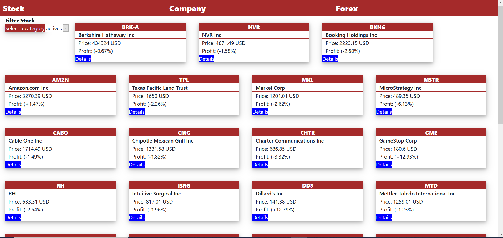

# React Bookstore

> This is a Catologue of Statistics app built with ReactJS, Redux, and Financial modeling prep API.
In this app the user can fetch stock market data by the most actives, the losers, and the gainers.
The user can also see company on different stock exchange, and Forex exchange.

## :red_circle: Screenshot

## :red_circle: Live Demo

[Live Demo Link](https://stock-guru.herokuapp.com/)

## :red_circle: Video

[video Link](https://gist.github.com/icebox827/27364bbde42e207b5018155369fbe422)

## :hammer: Built with

- React
- React routes
- React-Redux
- fmp API
- Heroku
- Redux
- HTML5
- CSS3
- JSX
- JavaScript
- Linters
- yarn
- VS code

## :construction_worker: Getting Started

To get a local copy up and running follow these simple steps:

1. Go to the [repository page](https://github.com/icebox827/stock-guru/).
2. Press the "Code" button and copy the link.
3. Clone it using git command `git clone <link>`.
4. Run `yarn install`
5. Run `yarn run start`

## :construction_worker: Test

To test the application:

1. Open a console.
2. Run `yarn test`

## Author

👤 **Denis Lafontant**

- GitHub: [@icebox827](https://github.com/icebox827)
- Twitter: [@heracles2k5](https://twitter.com/@heracles2k5)
- LinkedIn: [LinkedIn](https://www.linkedin.com/in/denis-lafontant/)

## 🤝 Contributing

Contributions, issues, and feature requests are welcome!

Feel free to check the [issues page](https://github.com/icebox827/stock-guru/issues).

## Show your support

Give a ⭐️ if you like this project!

### Acknowledgements

- Microverse
- Financial modelin prep

## 📝 License

This project is [MIT](LICENSE) licensed.
